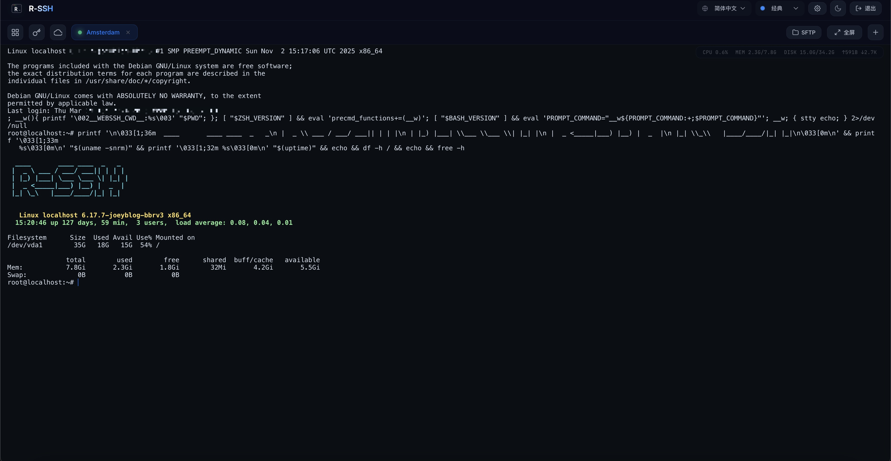
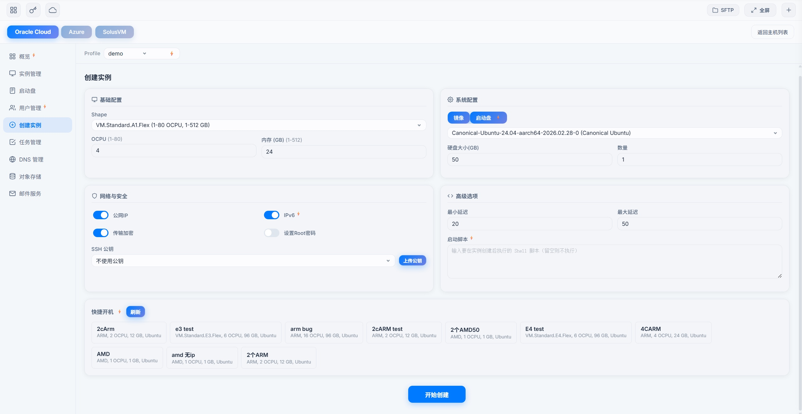
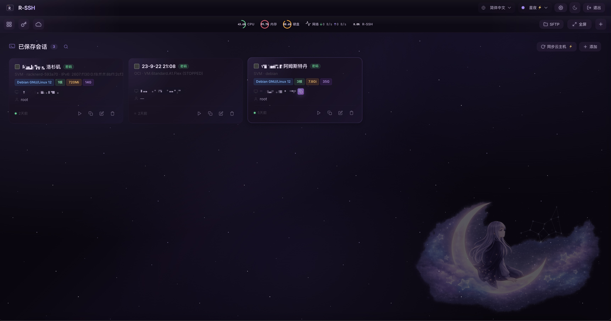
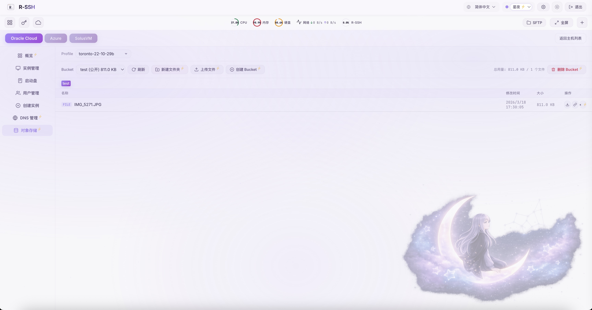

# <p align="left">R-Bot ⭐</p>

<p align="left">
  
  <a href="md/en/README.md"></a>
  <a href="https://t.me/apchyo"></a>
  <a href="https://t.me/agentONE_R"></a>
  <a href="https://t.me/radiance_helper_bot"></a>
  
</p>

## 概述

R-Bot 是一套**双端架构**的多云基础设施管理系统，通过 Telegram 机器人驱动本地客户端，快速管理 Oracle Cloud (OCI)、Azure、SolusVM 等云平台资源。客户端同时内置了完整的 **Web SSH 终端** 和 **Web 云管理面板**，在浏览器中即可完成服务器运维和云资源管理。

### 核心特性

| 特性 | 说明 |
|------|------|
| **双端安全架构** | API 私钥仅存储在本地客户端，机器人不存储任何敏感数据 |
| **Telegram 机器人管理** | 30+ 云操作：开机、IP 管理、磁盘、监控等 |
| **Web SSH 终端** | 浏览器内 SSH 连接，多标签页、SFTP 文件管理、端口转发 |
| **Web 云管理面板** | 浏览器内管理实例、网络、卷、用户、DNS、对象存储等 |
| **多云支持** | Oracle Cloud、Azure、SolusVM、Cloudflare DNS |
| **原生编译** | 亚秒级启动，极低内存占用 |





---

## 快速开始

### 1. 关注频道和机器人

- [Telegram 频道](https://t.me/agentONE_R) — 版本更新通知
- [Telegram 机器人](https://t.me/radiance_helper_bot) — 获取凭据和操作面板

### 2. 一键安装

```bash
wget -O sh_client_bot.sh https://github.com/semicons/java_oci_manage/releases/latest/download/sh_client_bot.sh && chmod +x sh_client_bot.sh && bash sh_client_bot.sh
```

> 建议先创建目录：`mkdir rbot && cd rbot`

### 3. 配置参数

在机器人中使用 `/raninfo` 生成用户凭据，填入 `client_config` 文件的 `username` 和 `password`，并添加云平台 API 参数。

详见 → [安装与配置](md/install.md)

### 4. 启动

```bash
bash sh_client_bot.sh
```

启动后即可通过 `https://你的IP:9527` 访问 Web SSH 终端和云管理面板。

---

## 功能总览

### Telegram 机器人 — 云管理

通过 Telegram 机器人操作，支持 Oracle Cloud 和 Azure。

- **实例管理** — 开机、升降配、重置系统、终止
- **IP 管理** — 换 IP、自动 DNS 更新、IPv6
- **磁盘管理** — 扩容、性能调优、分离/附加
- **监控告警** — 状态监控、自动换 IP、自动重启
- **账户管理** — 用户管理、API 密钥、2FA 重置、配额查询

完整列表 → [已实现功能](md/function.md) ｜ [机器人命令说明](md/BOT-README.md)

### Web SSH 终端

通过浏览器访问，无需安装客户端软件。

- **SSH 连接** — 密码/私钥认证，多标签页
- **资源监控** — 顶栏实时显示 CPU、内存、硬盘、网络指标
- **SFTP 文件管理** — 浏览、上传、下载、创建目录
- **端口转发** — 本地转发和远程转发
- **批量命令** — 向多个会话同时发送命令
- **会话管理** — 保存连接配置，集中密钥管理
- **SSL 证书** — 内置 ACME 自动签发（Let's Encrypt）
- **对象存储** — OCI Object Storage 的 Bucket 和文件管理

详见 → [Web SSH 终端指南](md/webssh.md)



### Web 云管理面板

在浏览器中直接管理多云资源，与 Telegram 机器人操作能力对齐。

- **实例管理** — 创建实例、快捷开机、启动、关机、重启、终止、重装系统、升降配
- **网络管理** — 换 IP、附加 IPv4/IPv6、保留 IP 管理
- **卷管理** — 调整容量、VPU 性能、分离/删除
- **用户管理** — 创建用户、重置密码、修改邮箱、清除 2FA
- **统计概览** — 成本、流量、订阅信息、配额查询
- **DNS 管理** — Cloudflare 域名记录的增删改查
- **对象存储** — OCI Object Storage 的 Bucket 和文件管理
- **Email Delivery** — 一键搭建邮件域（DKIM/DNS/SMTP 全自动）、测试发信
- **Azure 管理** — VM 创建/删除/重启、换 IP、资源用量
- **SolusVM 管理** — VPS 开关机/重启、状态仪表盘

详见 → [Web 云管理面板指南](md/cloud.md)



---

## 文档导航

| 文档 | 说明 |
|------|------|
| [安装与配置](md/install.md) | 安装脚本、配置参数、启动命令 |
| [已实现功能](md/function.md) | 完整功能列表（机器人 + Web SSH + 云管理） |
| [机器人操作与命令](md/BOT-README.md) | Telegram 机器人指令和键盘菜单说明 |
| [Web SSH 终端指南](md/webssh.md) | Web SSH 终端功能详解 |
| [Web 云管理面板指南](md/cloud.md) | Web 云管理面板功能详解 |
| [甲骨文云 API 配置](md/oracle.md) | 获取和上传 OCI API 参数 |
| [Azure API 配置](md/azure.md) | 获取和上传 Azure API 参数 |
| [常见问题](https://t.me/agentONE_R/41) | Telegram 频道置顶 FAQ |

---

## 常用命令

```bash
# 启动 / 重启（守护进程模式）
bash sh_client_bot.sh

# 指定端口启动
bash sh_client_bot.sh 8888

# 查看状态
bash sh_client_bot.sh status

# 查看日志（Ctrl+C 退出）
bash sh_client_bot.sh log

# 停止
bash sh_client_bot.sh stop

# 重启
bash sh_client_bot.sh restart

# 升级
bash sh_client_bot.sh upgrade

# 卸载
bash sh_client_bot.sh uninstall
```

---

## 系统架构

```
用户 → Telegram → R-Bot 服务端 → HTTP/WS → 本地客户端 → 云平台 SDK
用户 → 浏览器 → 本地客户端(Web UI) → 云平台 SDK
```

- **R-Bot 服务端** — 接收 Telegram 指令，路由到客户端执行
- **本地客户端** — 封装云平台 SDK 调用，提供 Web SSH + 云管理 UI
- **API 私钥** — 仅存于本地客户端，服务端不接触

---

## 支持的平台

| 客户端架构 | 下载包 |
|-----------|--------|
| Linux x86_64（AVX2） | `gz_client_bot_x86.tar.gz` |
| Linux x86_64（兼容） | `gz_client_bot_x86_compatible.tar.gz` |
| Linux ARM64 | `gz_client_bot_aarch.tar.gz` |
| macOS ARM64（Apple Silicon） | `gz_client_bot_mac_aarch.tar.gz` |

> 启动脚本会自动检测架构并下载对应版本。

---

## 声明

> 本系统为双端架构，API 私钥存储在你的本地客户端服务器。机器人驱动客户端操作，你可以随时关闭服务。介意请勿使用。
>
> <details>
> <summary>完整免责条款</summary>
>
> 本仓库发布的项目中涉及的任何脚本，仅用于测试和学习研究，禁止用于商业用途，不能保证其合法性、准确性、完整性和有效性，请根据情况自行判断。
>
> 所有使用者在使用项目的任何部分时，需先遵守法律法规。对于一切使用不当所造成的后果，需自行承担。对任何脚本问题概不负责，包括但不限于由任何脚本错误导致的任何损失或损害。
>
> 如果任何单位或个人认为该项目可能涉嫌侵犯其权利，则应及时通知并提供身份证明、所有权证明，我们将在收到认证文件后删除相关文件。
>
> 任何以任何方式查看此项目的人或直接或间接使用该项目的任何脚本的使用者都应仔细阅读此声明。本人保留随时更改或补充此免责声明的权利。一旦使用并复制了任何相关脚本或本项目的规则，则视为您已接受此免责声明。
>
> 您必须在下载后的 24 小时内从计算机或手机中完全删除以上内容。您使用或者复制了本仓库且本人制作的任何脚本，则视为已接受此声明，请仔细阅读。
> </details>

---

## 更新日志

<details>
<summary>查看 Releases 说明</summary>

> 持续证明该项目仍然存活

</details>
