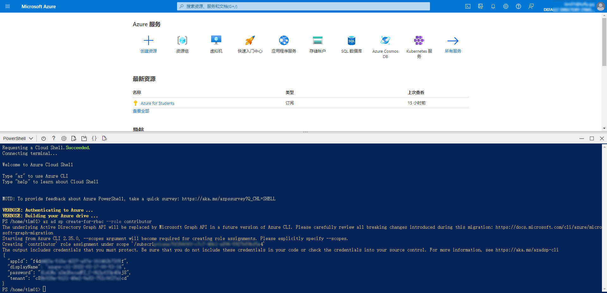

# Azure API Setup

[简体中文](../azure.md)

---

## Getting API Parameters

1. Log in to the [Azure Portal](https://portal.azure.com)
2. Click the **Cloud Shell** icon in the top-right corner
3. Select **PowerShell** and run the following command:

```powershell
az ad sp create-for-rbac --role contributor --scopes /subscriptions/$(az account list --query [].id -o tsv)
```

4. The command returns JSON like this:

```json
{
  "appId": "xxxxx-xxx-xx-xxx-xxxx",
  "displayName": "azure-cli-11111-12-111-11-222-22",
  "password": "xxxxx~oxjTxxxxxxxxb_I",
  "tenant": "xxxx-xxxx-xxxx-xxxx-xxxxxxxx"
}
```

<!-- Screenshot placeholder: Azure Cloud Shell steps -->


---

## Configuration Format

Convert the parameters into the following format and place them between `azure=begin` and `azure=end` in your `client_config` file:

```ini
[az001]
appId=551xxxx7-xxxx-xxxx-xxxx-b9xxxx60cc65
password=T618Q~.LIy_xxxxx~jm~xxxxxx
tenant=xxxx3713-xxxx-4cb5-xxxx-3001060xxxxx
```

---

## Upload Methods

### Method 1: Edit Configuration File

Edit `client_config` directly and add the configuration between `azure=begin` and `azure=end`.

### Method 2: Upload via Telegram Bot

Use the `/oci` command in the bot chat and send the raw JSON format:

```
/oci {
  "appId": "xxxxx-xxx-xx-xxx-xxxx",
  "displayName": "azure-cli-11111-12-111-11-222-22",
  "password": "xxxxx~oxjTxxxxxxxxb_I",
  "tenant": "xxxx-xxxx-xxxx-xxxx-xxxxxxxx"
}
```
