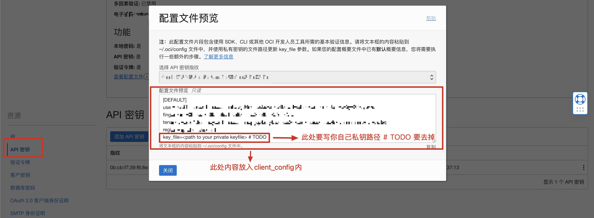

# Oracle Cloud API Setup

[简体中文](../oracle.md)

---

## Getting API Parameters

> If you only need boot/instance operations, it's recommended to create a user with limited permissions (e.g., instance management only) and use that user's API. This restricts what the API can do.

Any of the following methods will work:

### Method 1: Search for Domain

1. Switch to English interface, search for `domain`
2. Find **Services → Domains**, select your default Domain
3. Click **Users** on the left, select your user
4. Bottom-left **API keys** → Add API key

### Method 2: Search for Users

1. Switch to Chinese interface, search for "用户" (users)
2. Click on a username
3. **API Keys** → **Add API Key**
4. Click the `⋮` menu next to the fingerprint to view configuration parameters

### Method 3: Identity & Security Menu

1. Left navigation → **Identity & Security** → **Users**
2. Click on a username
3. **API Keys** → **Add API Key**
4. Click the `⋮` menu next to the fingerprint to view parameters

### Method 4: User Settings

1. Top-right → **User Settings**
2. **Resources** → **API Keys** → **Add API Key**
3. Click the `⋮` menu next to the fingerprint to view parameters

<!-- Screenshot placeholder: API parameter preview -->


---

## Configuration Format

After adding an API key, you'll get configuration in this format:

```ini
[DEFAULT]
user=ocid1.user.oc1..aaaaaaaaxxxxgwlg3xuzwgsaazxtzbozqq
fingerprint=b8:33:6f:xxxx:45:43:33
tenancy=ocid1.tenancy.oc1..aaaaaaaaxxx7x7h4ya
region=ap-singapore-1
key_file=/root/rbot/xxx.pem
```

> **Note**: `key_file` must be the path to the private key file on your server. The private key is generated and downloaded when adding the API key. Upload it to your server and fill in the correct path.

---

## Upload Methods

### Method 1: Edit Configuration File

Place the above configuration between `oci=begin` and `oci=end` in your `client_config` file.

### Method 2: Upload via Telegram Bot

Use the `/oci` command in the bot chat and send the configuration directly:

```
/oci [DEFAULT]
user=ocid1.user.oc1..aaaaaaaaxxxxgwlg3xuzwgsaazxtzbozqq
fingerprint=b8:33:6f:xxxx:45:43:33
tenancy=ocid1.tenancy.oc1..aaaaaaaaxxx7x7h4ya
region=ap-singapore-1
key_file=/root/rbot/xxx.pem
```

> For security, the private key file specified by `key_file` must be uploaded to your client server manually. The bot only stores the path.
