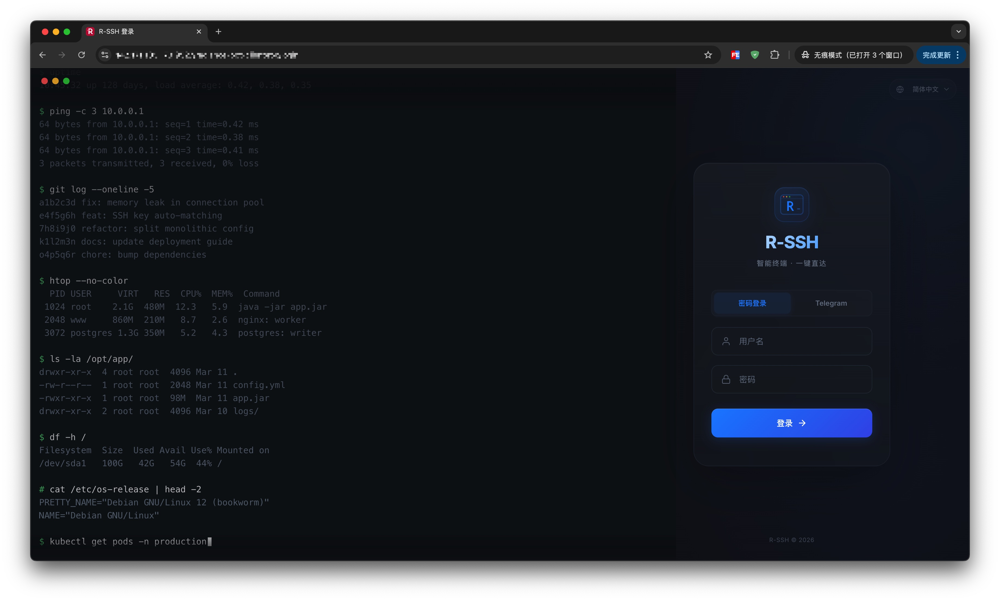

# Web SSH Terminal Guide

[简体中文](../webssh.md)

The R-Bot client includes a full-featured Web SSH terminal. Connect to and manage remote servers directly from your browser — no client software required.

---

## Access

After starting the client, visit:

```
https://YOUR_IP:9527
```

> Uses HTTPS + TLSv1.3 by default. On first visit, the browser will warn about the self-signed certificate — you can trust it manually or configure ACME auto-certificates.

---

## Login Authentication

Two login methods are supported:

### Password Login

Log in directly using the `username` and `password` configured in `client_config`.

### Telegram Verification Code

1. Click "Send Verification Code"
2. The bot sends an 8-digit code via Telegram
3. Enter the code within 60 seconds to log in

> Anti-abuse protection: After 3 consecutive requests within 10 minutes, a CAPTCHA (arithmetic question) is triggered to prevent brute-force attacks.



---

## SSH Connections

### New Connection

1. Click the "+" button or "New Connection" in the sidebar
2. Fill in connection details:
   - **Host** — IP address or domain name
   - **Port** — Default 22
   - **Username** — SSH login user
   - **Auth Method** — Password or private key
3. Click "Connect"

### Authentication Methods

| Method | Description |
|--------|-------------|
| **Password** | Enter SSH password |
| **Private Key** | Paste key content or select a saved key; supports passphrase |

### Host Fingerprint Verification

On first connection, the SHA256 host fingerprint is displayed for confirmation and saved. If the fingerprint changes on subsequent connections (possibly due to server reinstallation or a security risk), a warning is shown.

### Multi-Tab

Multiple SSH connections can be open simultaneously, each in its own tab, freely switchable.


---

## SFTP File Manager

After connecting via SSH, click the "SFTP" button in the toolbar to open the file management panel.

### Features

| Action | Description |
|--------|-------------|
| **Browse Directories** | Click folders to enter; breadcrumb navigation for quick jumping |
| **Upload Files** | Chunked upload with progress display |
| **Download Files** | Streaming transfer with 512KB chunks + sliding window acknowledgment |
| **Create Directory** | Create new folders in the current path |

<!-- Screenshot placeholder: SFTP file management panel -->
<!--  -->

---

## Port Forwarding

Configure SSH port forwarding while connected to a terminal.

### Local Forward

Map a remote service to a local port (e.g., access a remote database):

| Parameter | Example |
|-----------|---------|
| Bind Address | `127.0.0.1` |
| Bind Port | `3306` |
| Target Address | `127.0.0.1` |
| Target Port | `3306` |

### Remote Forward

Expose a local service to a port on the remote server.

<!-- Screenshot placeholder: Port forwarding configuration -->
<!--  -->

---

## Batch Commands

Send the same command to multiple connected sessions simultaneously — ideal for batch operations.

1. Click "Batch Commands" in the toolbar
2. Select target sessions (multi-select)
3. Enter the command and send

---

## Session Management

### Save Sessions

After a successful connection, save the current configuration as a session profile for one-click reconnection. Saved information includes:

- Host, port, username
- Auth method and credentials (encrypted storage)
- Default SFTP path

### SSH Key Management

Centralized management of all SSH private keys:

- Add / delete keys
- Auto-match saved keys when connecting
- Keys stored with AES encryption

<!-- Screenshot placeholder: Session list -->
<!--  -->

---

## OCI Object Storage Management

Manage OCI Object Storage directly from the web interface:

| Action | Description |
|--------|-------------|
| **Browse Buckets** | List all storage buckets |
| **Browse Objects** | Prefix filtering and pagination |
| **Upload Files** | Streaming upload with path traversal prevention |
| **Download Files** | Streaming download |
| **Delete Objects** | Delete individual files |
| **Create Folders** | Create directory structures |

<!-- Screenshot placeholder: OCI Object Storage interface -->
<!--  -->

---

## SSL Certificate Configuration

### Built-in Self-Signed Certificate

The client ships with a self-signed PKCS12 certificate — works out of the box.

### ACME Auto-Certificate (Let's Encrypt)

Supports automatic issuance and renewal of Let's Encrypt certificates. Requirements:

1. A domain name pointing to your server
2. Port 80 accessible (for HTTP-01 verification)

Configure in the web interface under "Settings":

| Parameter | Description |
|-----------|-------------|
| **Domain/IP** | Domain to bind the certificate to |
| **Email** | Let's Encrypt notification email |
| **Challenge Port** | HTTP-01 verification port, default 80 |

Once configured, certificates are issued automatically and renewed 2 days before expiry.

---

## Multi-Language Support

The web interface supports Chinese/English switching via the toggle in the top-right corner.

- 简体中文 (zh-CN)
- English (en)

---

## Technical Specifications

| Item | Specification |
|------|---------------|
| Protocol | HTTPS (TLSv1.3) + WebSocket |
| Terminal | xterm.js |
| Max Connections | 200 concurrent |
| Max Message Size | 8 MB |
| Stale Connection Cleanup | 30-minute timeout with auto-reclaim |
| Download Transfer | 512 KB chunks + sliding window (4 windows) |
